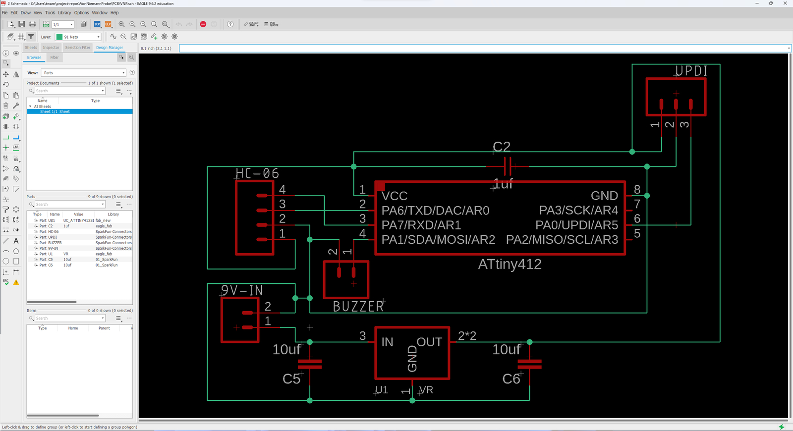
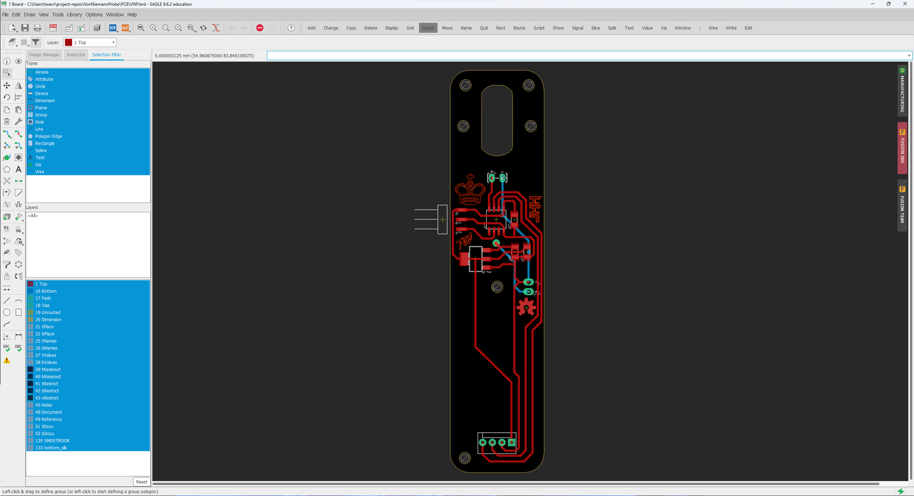
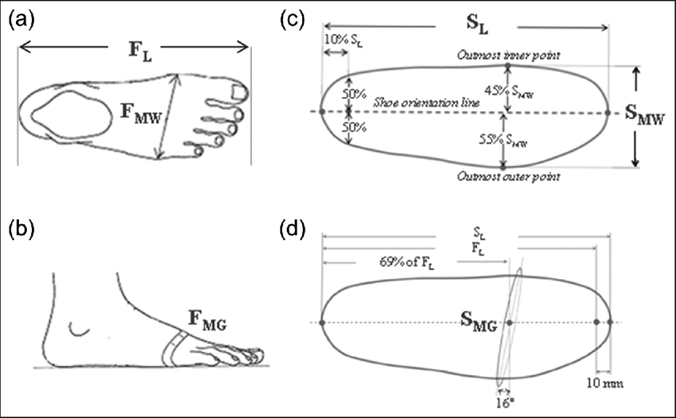
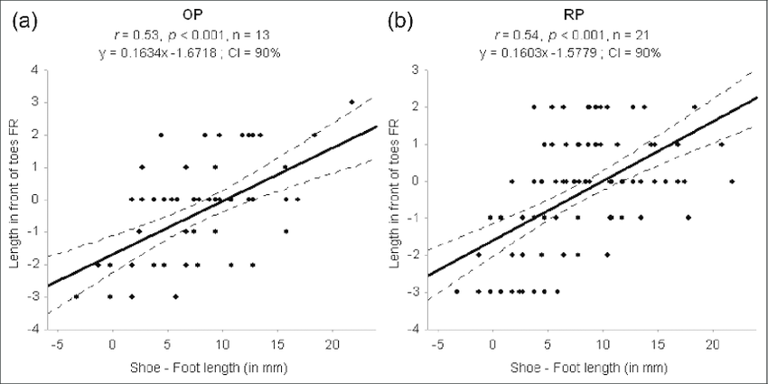
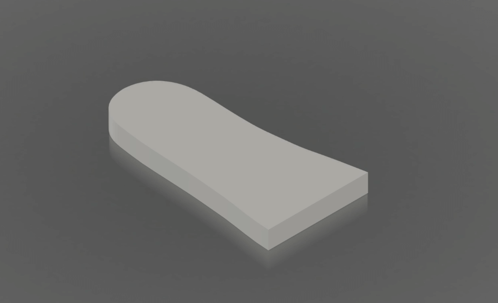
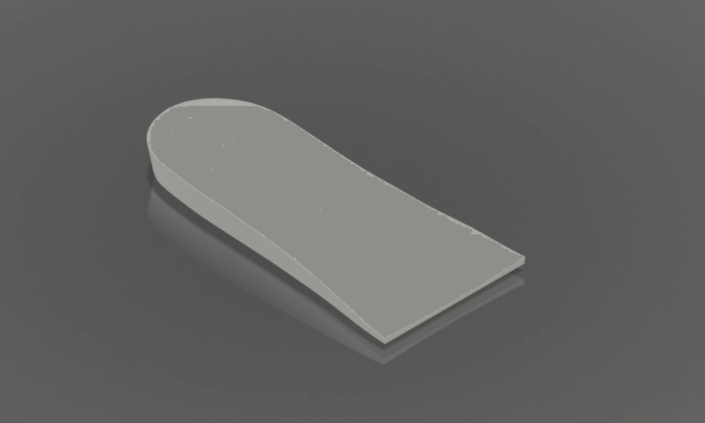
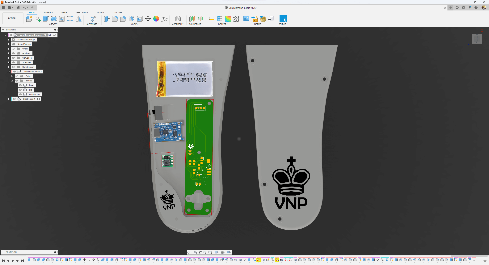
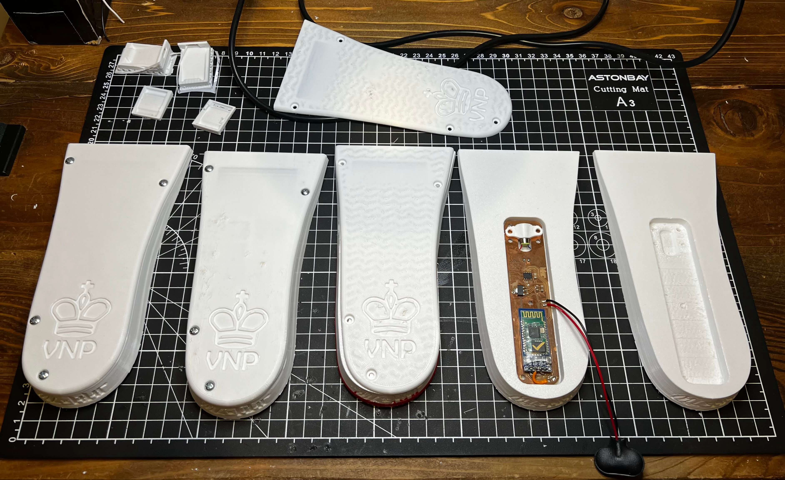
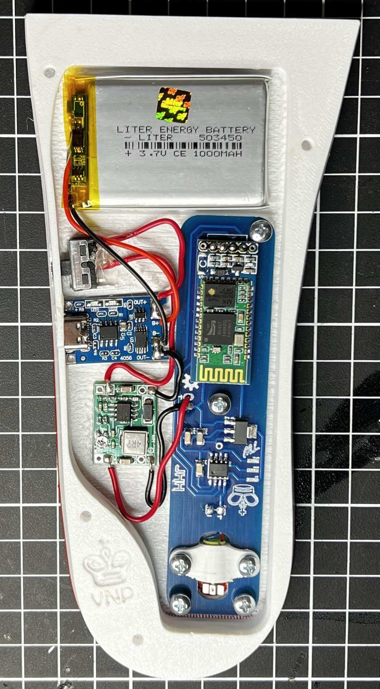
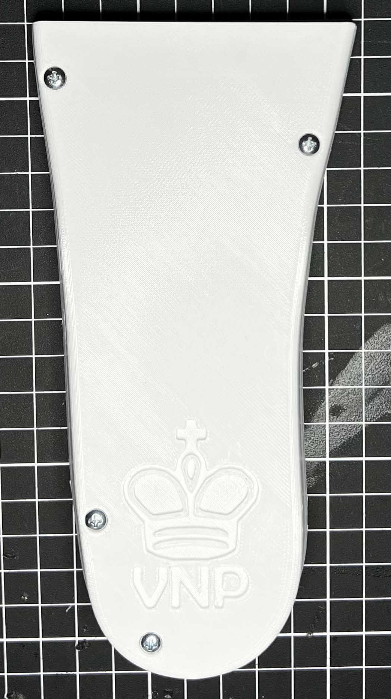

<head>
  <meta charset="UTF-8">
  <meta name="viewport" content="width=device-width, initial-scale=1.0">

  <script src="https://kit.fontawesome.com/79ff35ecec.js" crossorigin="anonymous"></script>
  <script src="https://cdnjs.cloudflare.com/ajax/libs/jquery/3.3.1/jquery.min.js"></script>

  <link rel="preconnect" href="https://fonts.googleapis.com">
  <link rel="preconnect" href="https://fonts.gstatic.com" crossorigin>
  <link href="https://fonts.googleapis.com/css2?family=Crimson+Pro:ital,wght@0,200..900;1,200..900&display=swap" rel="stylesheet">
  <link href="https://fonts.googleapis.com/css2?family=Crimson+Pro:ital,wght@0,200..900;1,200..900&family=JetBrains+Mono:ital,wght@0,100..800;1,100..800&display=swap" rel="stylesheet">

  <link rel="stylesheet" href="../../assets/css/projects/project.css">
  <link rel="stylesheet" href="../../assets/css/projects/vnp.css">
</head>

  <nav class="main-navigation">
    <ul>
      <li><a class="home" href="http://teddywarner.com"><span class="navnum">01</span> Home</a></li>
      <li><a class="proj" href="http://teddywarner.com/proj/"><span class="navnum">02</span> Projects</a></li>
      <li><a class="writ" href="http://teddywarner.com/writ/"><span class="navnum">03</span> Writing</a></li>
    </ul>
  </nav>

<div class="return2feed"><a href="http://teddywarner.com/proj"><i class="fa-solid fa-arrow-left-long"></i> Project Feed</a></div>

# Von Niemann Probe

<div style="margin-top: -0.8em;">
  <span class="abtlinks"><a href="https://x.com/WarnerTeddy"><span class="abt" id="name"> Teddy Warner</a><span style="font-weight: 300; padding-right: 5px;"> & </span><a href="http://fabacademy.org/2021/labs/charlotte/students/jack-hollingsworth/about/"><span class="abt" id="name"> Jack Hollingsworth</a><span class="abt" style="font-weight: 300; padding-left: 6px;"><span class="year">| Winter, 2023 </span>| <span class="readTime"><i class="far fa-clock"></i> 46–58 minutes</span></span></span></span>
  <span class="share" style=" color: inherit;">
  <a class="fb" title="Share on Facebook" href="https://www.facebook.com/sharer/sharer.php?u=https://teddywarner.org/Projects/VonNiemannProbe/"><i class="fa-brands fa-facebook"></i></a>
  <a class="twitter" title="Share on Twitter" href="https://twitter.com/intent/tweet?url=https://teddywarner.org/Projects/VonNiemannProbe/&text=Check%20out%20the%20Von%20Niemann%20Probe%20on%20teddywarner.org!"><i class="fa-brands fa-x-twitter"></i></a>
  <a class="pin" title="Share on Pinterest" href="https://pinterest.com/pin/create/button/?url=https://teddywarner.org/Projects/VonNiemannProbe/&media=&description=Check%20out%20the%20Von%20Niemann%20Probe%20on%20teddywarner.org!"><i class="fa-brands fa-pinterest"></i></a>
  <a class="ln" title="Share on LinkedIn" href="https://www.linkedin.com/shareArticle?mini=true&url=https://teddywarner.org/Projects/VonNiemannProbe/"><i class="fab fa-linkedin"></i></a>
  <a class="email" title="Share via Email" href="mailto:info@example.com?&subject=&cc=&bcc=&body=https://teddywarner.org/Projects/VonNiemannProbe/%0ACheck%20out%20the%20Von%20Niemann%20Probe%20on%20teddywarner.org!"><i class="fa-solid fa-paper-plane"></i></a>
  </span>
</div>

---

<center>
  <div style="position:relative;padding-bottom:56.25%;">
    <iframe width="100%" height="100" style="width:100%;height:100%;position:absolute;left:0px;top:0px;" src="https://www.youtube.com/embed/ygy8M-QhbSo" title="" frameborder="0" allow="accelerometer; autoplay; clipboard-write; encrypted-media; gyroscope; picture-in-picture; web-share" allowfullscreen></iframe>
  </div>

**An AVR-based Bluetooth telegraphing shoe insole that lets you play chess in the way Hans Niemann has been accused!**

</center>

!!! tip "Project Sponsor"
    {: align=right width="45%"}
    <center style="font-size:1.15em; width:55%;">**The development of the Von Niemann Probe was made possible by [PCBWay](https://www.pcbway.com/), who provided the fabrication of the probe's main board and nylon insole.** Be sure to check out [PCBWay.com](https://www.pcbway.com/) for all your PCB prototyping, assembly, design, CNC, and 3D printing needs! Thank you to the wonderful folks at [PCBWay](https://www.pcbway.com/) for sponsoring this project!</center>
    
On September 4, 2022, 19-year-old rising chess superstar, Grandmaster Hans Moke Niemann, shocked the chess world when he ended the 8-time World Champion, and arguably the greatest player in world history, Magnus Carlsen's unprecedented 53-game win streak at the Sinquefield Cup in St. Louis, Missouri. Niemann added insult to injury by accomplishing this as the lowest-ranked player in the tournament while playing with the black pieces, which possess a slight, but crucially important, disadvantage at the highest levels of competition. 

Soon after his loss, Carlsen withdrew from the Sinquefield Cup without explanation, a bizarre occurrence due to the remaining six rounds in the tournament. While chess enthusiasts on the internet grappled with possible reasons for Carlsen's withdrawal, Carlsen posted the tweet below, depicting Portuguese football manager José Mourinho saying "If I speak I am in big trouble", a brief innuendo to the accusations to come.

<center>
  <span class="lighttweet"><blockquote id='tweet' class="twitter-tweet" data-theme="light"><p lang="en" dir="ltr">I&#39;ve withdrawn from the tournament. I&#39;ve always enjoyed playing in the <a href="https://twitter.com/STLChessClub?ref_src=twsrc%5Etfw">@STLChessClub</a>, and hope to be back in the future <a href="https://t.co/YFSpl8er3u">https://t.co/YFSpl8er3u</a></p>&mdash; Magnus Carlsen (@MagnusCarlsen) <a href="https://twitter.com/MagnusCarlsen/status/1566848734616555523?ref_src=twsrc%5Etfw">September 5, 2022</a></blockquote> <script async src="https://platform.twitter.com/widgets.js" charset="utf-8"></script></span>
  <span class="darktweet"><blockquote id='tweet' class="twitter-tweet" data-theme="dark"><p lang="en" dir="ltr">I&#39;ve withdrawn from the tournament. I&#39;ve always enjoyed playing in the <a href="https://twitter.com/STLChessClub?ref_src=twsrc%5Etfw">@STLChessClub</a>, and hope to be back in the future <a href="https://t.co/YFSpl8er3u">https://t.co/YFSpl8er3u</a></p>&mdash; Magnus Carlsen (@MagnusCarlsen) <a href="https://twitter.com/MagnusCarlsen/status/1566848734616555523?ref_src=twsrc%5Etfw">September 5, 2022</a></blockquote> <script async src="https://platform.twitter.com/widgets.js" charset="utf-8"></script></span>
</center>

Carlsen's message drove many chess fans around the globe quickly began to lob accusations of foul play at Niemann, who has had a history of cheating in online games, and speculate on how he could have cheated in an over-the-board match. A theory that Niemann used a wearable device to relay computer-generated moves was quickly popularized and became incredibly popular amongst chess fans and the broader internet. Despite the internet's suspicions, no clear accusations were placed, nor did any solid evidence surface. Yet, on September 8th, 2022, [Chess.com](https://www.chess.com/home) released the tweet seen below, confirming it had removed Hans Moke Niemann from its user base for cheating.

<center>
  <span class="lighttweet"><blockquote id='tweet1' class="twitter-tweet" data-theme="light"><p lang="zxx" dir="ltr"><a href="https://t.co/sFMrmocLcS">pic.twitter.com/sFMrmocLcS</a></p>&mdash; Chess.com (@chesscom) <a href="https://twitter.com/chesscom/status/1568010971616100352?ref_src=twsrc%5Etfw">September 8, 2022</a></blockquote> <script async src="https://platform.twitter.com/widgets.js" charset="utf-8"></script></span>
  <span class="darktweet"><blockquote id='tweet1' class="twitter-tweet" data-theme="dark"><p lang="zxx" dir="ltr"><a href="https://t.co/sFMrmocLcS">pic.twitter.com/sFMrmocLcS</a></p>&mdash; Chess.com (@chesscom) <a href="https://twitter.com/chesscom/status/1568010971616100352?ref_src=twsrc%5Etfw">September 8, 2022</a></blockquote> <script async src="https://platform.twitter.com/widgets.js" charset="utf-8"></script></span>
</center>

These direct allegations from [Chess.com](https://www.chess.com/home) spurred further allegations against Niemann, as well as his confession to cheating on two separate occasions, both in online games, once at age 12 and another at 16. Yet, Niemann denied ever cheating over the board, even offering to "strip fully naked"[^16] or "to play in a closed box with zero electronic transmission"[^16] to prove his innocence. 

To only further the drama, on Monday, September 26, 2022, the pair were re-matched in an online tournament in which Carlsen resigned after playing a single move. Later that night, Carlsen released his open accusations against Niemann claiming he believes that "Niemann has cheated more — and more recently — than he has publicly admitted."[^18] Carlsen claims he derived his initial suspicions form Niemann's rapid rise through the chess ranks. For reference, Niemann surged from being approximately 800 in the world, to within the top 50 over the 20 months leading up to the Sinquefield Cup. GM Hikaru Nakamura describes this rise as "unprecedented"[^14] and [Chess.com](https://www.chess.com/home) claims that Niemann is the "fastest rising top player ... in modern recorded history"[^13], yet others find it comparable to top junior ranked players. Carlsen outline in his formal accusation (found in the tweet below) that Niemann "wasn't tense or even fully concentrating"[^18] while outplaying him using the black pieces "in a way I think only a handful of players can do"[^18] during the tournament. 

<center>
  <span class="lighttweet"><blockquote id='tweet2' class="twitter-tweet" data-theme="light"><p lang="en" dir="ltr">My statement regarding the last few weeks. <a href="https://t.co/KY34DbcjLo">pic.twitter.com/KY34DbcjLo</a></p>&mdash; Magnus Carlsen (@MagnusCarlsen) <a href="https://twitter.com/MagnusCarlsen/status/1574482694406565888?ref_src=twsrc%5Etfw">September 26, 2022</a></blockquote> <script async src="https://platform.twitter.com/widgets.js" charset="utf-8"></script></span>
  <span class="darktweet"><blockquote id='tweet2' class="twitter-tweet" data-theme="dark"><p lang="en" dir="ltr">My statement regarding the last few weeks. <a href="https://t.co/KY34DbcjLo">pic.twitter.com/KY34DbcjLo</a></p>&mdash; Magnus Carlsen (@MagnusCarlsen) <a href="https://twitter.com/MagnusCarlsen/status/1574482694406565888?ref_src=twsrc%5Etfw">September 26, 2022</a></blockquote> <script async src="https://platform.twitter.com/widgets.js" charset="utf-8"></script></span>
</center>

The implications of such an unprecedented accusation against a player at the GM (Grandmaster) level are highly slanderous. Grandmaster Nigel Short notes that cheating at this level of chess is exceptionally rare, as any proven allegations would end a player's career. GM Short told the BBC "I think in the absence of any evidence, statement or anything, then this is a very unfortunate way to go about things. It's death by innuendo."[^14] Furthering GM Short's skepticism, Professor Kenneth Regan, widely considered to be the world's leading expert on chess cheating, took it upon himself to analyze Niemann's games and found no evidence of cheating. 

Naturally, Niemann isn't taking kindly to these slanderous accusations, and has filed a federal lawsuit accusing Carlsen of "maliciously colluding with others to defame [him] and ruin his career."[^1] Niemann is after at least *$100 Million* in damages from defendants Carlsen, his company Play Magnus Group, the online platform Chess.com and its leader, Danny Rensch, as well as grandmaster Hikaru Nakamura. The court filing, found below, accuses GM Nakamura and Chess.com of bolstering Carlsen's "egregious" claims through their platforms.

Niemann's counterattack hasn't ended in his pursuit of reparations, Niemann claims Carlsen couldn't handle losing to him, implying through his court filing that Carlsen's actions further support his notorious "inability to cope with defeat."[^20] The court filing states that Carlsen's actions were taken in an attempt to solidify his status as "king of chess"[^20] so he could complete his company's buyout by Chess.com - a *$82.9 million* acquisition.[^21] 

Niemann's victory over the world champion, "should have propelled Niemann's career to the next level and allowed him to continue realizing his enormous potential as the next great American chess player."[^20] Yet, "Unbeknownst to Niemann at the time, Defendants would do whatever it took to ensure that this would never happen."[^20]

<center>
  <iframe src="https://drive.google.com/file/d/1Gtqr3ASuJxgTa3li6C0mxTj4dTvbuYLU/preview" width="100%" height="600" allow="autoplay"></iframe>
</center>

It's worth mentioning again that Niemann has publically admitted to cheating with aid from electronic devices in online matches, once at age 12 and again at age 16. Niemann referred to one of these instances as "an absolutely ridiculous mistake"[^22], while maintaining that he had never cheated in a tournament with prize money. 

A couple of weeks after their initial accusations, [Chess.com](https://www.chess.com/home) released a formal, 72-page report (found below) outlining an investigation into Niemann's play, and alleging that **Niemann has likely cheated with electronic aid in more than 100 games, and as recently as 2020**, including in matches where money was on the line. The magnitude of Niemann's alleged cheating scandal, as presented in [Chess.com](https://www.chess.com/home)'s report, proves to be much larger and longer-lasting than Niemann publically admitted. [Chess.com](https://www.chess.com/home)'s investigation relied on a variety of analytical tools to compare the moves of Niemann to those recommended by chess engines, and noted "many remarkable signals and unusual patterns in Hans’ path as a player.”[^13] The site claims that "while [they] don’t doubt that Hans is a talented player, we note that his results are statistically extraordinary”[^13], and their investigation into Niemann's gameplay has uncovered "blatant cheating".[^13] **The report states that Niemann privately confessed to these allegations and that his Chess.com account was subsequently closed in 2020.**

In a private letter to Niemann, Chess.com's Chief Chess Officer, Danny Rechsch writes "We are prepared to present strong statistical evidence that confirms each of those cases above, as well as clear ‘toggling’ vs ‘non-toggling’ evidence, where you perform much better while toggling to a different screen during your moves".[^13] While the report outlines that [Chess.com](https://www.chess.com/home) has historically treated bans as a private matter, the ongoing accusations and Niemann's ban from the site's Global Championship spurred the platform to provide the investigation that provided justification for their decisions. 

<center>
  <iframe src="https://drive.google.com/file/d/11IokKgTVSXdpYEzAuyViIleSZ_2wl0ag/preview" width="100%" height="600" allow="autoplay"></iframe>
</center>     

While this evidence against Niemann appears to be overwhelming, it's important to remember that the Sinquefield Cup is an over-the-board tournament. Cheating online and over the board are two entirely separate entities, no amount of online cheating in the world provides sufficient reason to accuse Hans of over-the-board cheating, as the act itself is a different task that would require extreme preparation to achieve. Thus, in face of a lack of evidence to support over-the-board cheating allegations against Niemann, the Von Niemann Probe was born. In an attempt to further the investigation into this scandal, we developed an AVR-based Bluetooth telegraphing shoe insole to test the feasibility of creating and using an over-the-board chess cheating aid.

!!! failure "Cheating in Chess"

    ***Cheating in chess, whether online or over the board, is wrong and ruins the game for everyone.*** This project has been published to showcase the possibility of such a device's existence/use, and should not be recreated with the intent of using it for genuine foul play.

!!! note "Name Orgins"
    The Von Niemann Probe is named after a theoretical self-replicating space probe known as the Von Neumann Probe, named after legendary 20th century Hungarian-American mathematician *John Von Neumann*. The Von Neumann Probe is regarded as the optimal way to explore the cosmos, as it can mine asteroids and leverage the exponential growth of its progeny to more efficiently visit star systems. And, coincidentally, probes are also medical devices that can be used to explore one’s bowels. Thus, we settled on naming our device the Von Niemann Probe.

<center>

  [Von Niemann Probe Repository :fontawesome-brands-github:](https://github.com/Twarner491/VonNiemannProbe){: align=right .md-button .md-button--primary }

</center>

## Telegraph Design

### PCB Design & Integration

At the heart of the Von Niemann Probe lies an AVR ATtiny 412-based Bluetooth telegraph. This PCB is capable of interpreting Bluetooth serial data from our chess engine (see Step 3), and translating the signal to pulses of a vibration motor. Before starting any PCB design work in Autodesk EAGLE, I took some time to write out these expectations for the systems operating principle and then began the PCB schematic. The VNP mainboard is a barebones ATtiny 412 setup, including voltage regulation and smoothing capacitors, as well as headers for connection to a Bluetooth module, vibration motor, and battery power.

The schematic includes headers for an HC-06, with serial connections to the ATTiny 412, and a shared power line with both the IC and Vibration Motor. This vibration motor is wired both to common GND on the PCB, as well as to *Digital Pin 2*, allowing the IC to pulse the motor to convey moves in morse code.

<center>

{width="100%"}

</center>

With this schematic done, I moved on to generating my final board file. The PCB is built around the rectangular nature of the HC-06 Bluetooth module - one of these modules is placed in the center of the PCB, allowing for an as-compact-as-possible footprint ideal for fitting in the VNP's discrete insole body (see Step 2). Just above the HC-06 module lies the ATtiny 412 circuit and UPDI programming pins, as well as a cutout and mounting points for the telegraph's vibration motor. The entire PCB is designed to be mounted inside the VNP insole with M3 screws and has been designed to maintain a large, shared surface area with the 3D-printed insole to ensure the transfer of vibration from the telegraph.

<center>

{width="100%"}

</center>

<center>
<iframe src="https://myhub.autodesk360.com/ue2cecd93/shares/public/SH9285eQTcf875d3c539a842c922b0c2da02?mode=embed" width="100%" height="650" allowfullscreen="true" webkitallowfullscreen="true" mozallowfullscreen="true"  frameborder="0"></iframe>
</center>

### Parametric Shoe Insole

To prove the feasibility of the accusations placed against Hans Niemann, the Von Niemann Probe (VNP) must be robust enough to see consistent use, while remaining discrete enough to not be detected. With this in mind, we selected to place our Bluetooth telegraph inside the body of a parametric shoe insole. The VNP was designed in Autodesk's Fusion 360, and makes heavy use of the software's Parametric Engine, allowing a custom insole to be generated for all foot sizes. Using the shoe size standards found in the table below, an insole may be generated to fit your exact foot dimensions. *Note - the sizes included in the table below are Mens, as that is the style of shoe both Jack and I wear - be sure to convert your shoe size accordingly.*

<center>

{width="80%"}

| US Size | UK Size | European Size | Japanese Size | Length *(S~L~)* | Width *(S~MW~)* |
|---------|---------|---------------|---------------|--------|--------|
| 6       | 5.5     | 39            | 25            | 23.5cm | 8.9cm  |
| 6.5     | 6       | 39/40         | 25.5          | 24.1cm | 9cm    |
| 7       | 6.5     | 40            | 26            | 24.4cm | 9.2cm  |
| 7.5     | 7       | 40/41         | 26.5          | 24.8cm | 9.4cm  |
| 8       | 7.5     | 41            | 27            | 25.4cm | 9.5cm  |
| 8.5     | 8       | 41/42         | 27.5          | 25.7cm | 9.7cm  |
| 9       | 8.5     | 42            | 28            | 26cm   | 9.8cm  |
| 9.5     | 9       | 42/43         | 28.5          | 26.7cm | 10cm   |
| 10      | 9.5     | 43            | 29            | 27cm   | 10.2cm |
| 10.5    | 10      | 43/44         | 29.5          | 27.3cm | 10.3cm |
| 11      | 10.5    | 44            | 30            | 28.9cm | 10.5cm |
| 11.5    | 11      | 44/45         | 31            | 28.3cm | 10.6cm |
| 12      | 11.5    | 45            | 32            | 28.6cm | 10.8cm |
| 12.5    | 12      | 45/46         |               | 29.2cm | 11cm   |
| 13      | 12.5    | 46            |               | 29.5cm | 11.1cm |
| 13.5    | 13      | 46/47         |               | 30.2cm | 11.3cm |
| 14      | 13.5    | 47            |               | 31cm   | 11.4cm |
| 14.5    | 14      | 47/48         |               | 31cm   | 11.6cm |
| 15      | 14.5    | 48            |               | 31.4cm | 11.7cm |

{width="80%"}

</center>

A custom insole will be generated after updating the model with your foot Length *(S~L~)* & Width *(S~MW~)* via Fusion's *Change Parameters* tool. Paste in your foot length *(S~L~)* in the *InsoleLegnth* expression input, and repeat with your foot width *(S~MW~)* and the *InsoleWidth* expression input.

<center>

{width="100%"}

</center>

After establishing the model's parameters and extruding a basic shape, I drafted the insole's outer edge to allow the insole to fit the angled inner walls of shoes, before using Fusion 360's *Surface* workspace to ad a 3D profile to the top of the insole.

<center>

{width="48.35%"}
{width="49%"}

</center>

The insole consists of two main parts, the body which is the bulk of the insole itself, and the lid, which screws to the bottom of the body, covering the electronics compartment. The body of the insole consists of mounting points for the main PCB, as well as a 1000mah LiPo battery, a USB-C LiPo charging board, a power switch, and a 3.3v to 5v boost converter. The lid not only hides the VNP's electronics system from sight but also redistributes the load placed upon the insole when a user is standing on it.  

<center>

{width="100%"}

</center>

<center>
  <iframe src="https://myhub.autodesk360.com/ue2cecd93/shares/public/SH9285eQTcf875d3c53962a650b709446403?mode=embed" width="100%" height="650" allowfullscreen="true" webkitallowfullscreen="true" mozallowfullscreen="true"  frameborder="0"></iframe>
</center>

## Chess Engine

The Von Niemann Probe is useless without a competent artificial intelligence running the show behind the scenes, obviously requiring a hefty amount of code to get it to work properly. I decided to build the brains around Stockfish, a famous chess engine that already has a functioning Python integration and also happens to be the highest-rated engine at the time of writing. For reference, the engine plays at a 4000 level, while the current highest-rated player, Magnus Carlsen, is currently sitting at about 3200. Safe to say, Stockfish is more than sufficient for the players our insole will encounter who are obviously considerably worse than Carlsen.

<!--
<div class="content">
  <div class="chess-area">
    <div class="board-table">
      <div id="board-top-controls" class="top-controls">
        <div id="game-promotion" class="promotion hidden">
          <span figure="q">Queen</span>
          <span figure="b">Bishop</span>
          <span figure="n">Knight</span>
          <span figure="r">Rook</span>
        </div>
        <div id="board-resign-game-area" class="popup hidden">
          <span class="close"></span>
          <label>Do you want to resign?</label>
          <button class="yes">Yes</button>
          <button class="no">No</button>
        </div>
      </div>
      <div id="board" class="board"></div>
        <div id="board-controls" class="controls">
          <div id="board-messages" class="messages hidden" style="display: none !important;"></div>
        </div>
      </div>
      <div class="board-settings">
        <div class="apex">
          <span class="label-history">Play Stockfish!</span>
          <div style="display: none;" class="game-level" id="game-difficulty-option" title="Choose The Engine's Skill Level">
            <span class="label"></span>
            <span class="value" id="game-difficulty-skill-value"></span>
          </div>
        </div>
        <div class="game-difficulty hidden" id="game-difficulty-skill-settings">
          <span class="label">Select Engine's Level:</span>
          <span class="close"></span>
          <div class="values">
            <span class="1">1</span>
            <span class="2">2</span>
            <span class="3">3</span>
            <span class="4">4</span>
            <span class="5">5</span>
            <span class="6">6</span>
            <span class="7">7</span>
            <span class="8">8</span>
            <span class="9">9</span>
            <span class="10 selected">10</span>
            <span class="11">11</span>
            <span class="12">12</span>
            <span class="13">13</span>
            <span class="14">14</span>
            <span class="15">15</span>
            <span class="16">16</span>
            <span class="17">17</span>
            <span class="18">18</span>
            <span class="19">19</span>
            <span class="20">20</span>
          </div>
        </div>
        <div class="turns-history" id="game-turns-history">
          <ol></ol>
        </div>
        <div class="game-analyze hidden" id="game-analyze-string"></div>
        <div class="game-menu hidden" id="game-settings">
          <span class="label-choose-side">Select Side</span>
          <span class="btn game-white-side selected" id="btn-choose-white-side"></span>
          <span class="btn game-black-side" id="btn-choose-black-side"></span>
        </div>
        <div class="tunes">
          <span id="btn-new-game" title="Start New Game" class="btn-new-game">
            <span class="icon"></span>
            <span class="label">New Game</span>
          </span>
          <span style="display: none;" id="btn-settings" title="Choose The Engine's Skill Level" class="btn settings"></span>
          <span id="btn-resign" title="Resign" class="btn resign"></span>
          <span style="display: none;" id="btn-analyze" title="Request Engine Evaluation" class="btn analyze">
            <i class="icon"></i>
          </span>
        </div>
        <div class="params">
          <div class="cell side" id="game-player-side" style="display: none;">
            <label>Your Side:</label>
              <span class="white active">White</span>
              <span class="black">Black</span>
          </div>
          <div class="cell first-turn" id="game-first-turn" style="display: none;">
            <label>First Turn:</label>
              <span class="player active">Player</span>
              <span class="computer">Computer</span>
          </div>
        </div>
      </div>
    </div>
  <div class="chess-log"></div>
</div>
-->

!!! warning "Python Dependencies"
      **Various Python dependencies are needed to run the chess engine script**, but overall the installation is pretty lightweight. Install commands for all Python dependencies are below, any release past Python 3.7 will work.

      ```
      pip install regex
      pip install python-chess
      ```

### Downloading & Configuring Stockfish

First, I downloaded Stockfish and extracted it locally on my Windows PC. I used Version 15 in this project. A more current version can be downloaded from [stockfishchess.org](https://stockfishchess.org/download/) or use this [permanent download link](https://stockfishchess.org/files/stockfish_15_win_x64_avx2.zip) of the version that I used during development.

Next, I researched the Stockfish Python module and integrated it into a continuous loop in Python that would allow it to play games repeatedly without requiring the relaunching of the code. The module is pretty simple to instantiate, but it does feature a few optional parameters that can regulate its strength and how much hardware it occupies locally.

```
stockfishPath = "C:/…" #replace with the path to your Stockfish exe. 
#Note - the path may only contain forward slashes, no backslashes.
```

I began by adding a path variable to my Python program that stores the local path of the Stockfish installation. The path can be found by navigating to the folder that stores Stockfish and finding the .exe file inside of the folder. I then placed this path into the variable, making sure to replace the backslashes that windows copies with for forward slashes. The code will not run with backslashes.

```
fish = Stockfish(r"{0}".format(stockfishPath),
depth=18, parameters={"Threads": 4, "Hash": 256, "UCI_LimitStrength": "false"}) #stockfish object declaration, can regulate strength

print("WDL Accepted " + str(fish.does_current_engine_version_have_wdl_option()))
```

I then configured Stockfish inside of the program. The above snippet instantiates stockfish, creating an object called "fish" that can be called using the Python Stockfish module.

```
print("Board State " + fish.get_board_visual()) #prints unicode image of current board state
```

The Python Stockfish module also features a function that prints a Unicode display of the current board state! This proved very useful during debugging to follow along with games that are not being played physically.

```
while True:
    isMate = False
    print("side of stockfish:")
    fishSide = input()
    playGame(fishSide)
```

I then created an infinite loop that takes the side of the player wearing the insole that launches one of two loops that allow games to be played inside of the playGame() function.

```
def playGame(side):
    global legal; global legalMoves
    global board; global isMate; global morseMove; 
    mate = False
    turns = 0; i = 0
    board = chess.Board()
    print("fish playing as " + side)
```

Several declarations occur at the top of the *playGame()* function regardless of what side Stockfish is on. These lines help keep track of legality and reset the state of the board in the two modules that track it. The importance of these modules is detailed later on in this section.

```
if side == "white":
        while mate == False:
            bestMove = fish.get_best_move(1000)
            fish.make_moves_from_current_position([bestMove]);
            chessMove = chess.Move.from_uci(bestMove) #create chessMove 
            print("whitefish plays " + bestMove)
```

I decided to start by writing code for games for when the engine is generating moves for the white pieces. Stockfish will immediately generate a move in this case so this made early development a bit easier. The above snippet generates the optimal move from the starting position and plays it.

```
print("black move:") #request player move
move = input()
#The above lines request the move of the engine's opponent that is playing on the black pieces.
```

After black's move is input, one turn has passed, and now it is time for the engine to respond to the human player's move. But before that can happen, the program needs to check the legality of the Stockfish move. If the Stockfish module is passed an illegal move that cannot be played given a current board position, it crashes. So I needed to create a function to test the legality of moves before passing them to the Stockfish module to avoid this potential point of failure.

### Checking Move Legality

While the Python Stockfish module is robust and does have many useful features, it does not natively feature a function to check the legality of a move. As such, I decided to add the python-chess module to run a legality check on each move before passing it to Stockfish, prompting the user to enter another move if a move is not legal, preventing crashes due to misinput.

```
board = chess.Board(); #create chess board object
```

The above function call creates a Board object that allows for the calling of the many functions included in the python-chess module.

The python-chess module features a board.is_legal() function that checks the legality of a formatted move object given the current state of a board object. It returns a boolean that reflects the legality of a move. However, it needs to be passed a chess.Move object which must be created using letters and numbers that can appear in chess moves. As such, any input that is incorrect, say "n9z0" would not create a move object and would trigger a crash. Therefore, it is necessary to verify that input only contains properly formatted characters that can actually exist in a chess move before trying to use the is_legal() function.

```
badChars = ["i", "j", "k", "l", "m", "n", "o", "p", "q", "r", "s", "t", "u", "v", "w", "x", "y", "z",
"9", "0"] #chars that can't be in a legal chess move
```

I started by creating a dict that contains all of the characters that cannot appear in a legal chess move.

```
for char in move: #check if badChars exist in move
        i = 0 #reset iterating var
        while i < len(badChars):
            badChar = badChars[i]
            if char == badChar:
                print(char + ' is ILLEGAL')
                noBadChars = False #set bool to reflect bad char
            if char.isalpha() == True:
                charCount += 1 #reflect that at least 1 char in string
            if char.isdigit() == True:
                numCount += 1 #reflect that at least one number in string
            i += 1
            #print(char + "is legal") #debug bad chars function
```

I then wrote some code to iterate through each character in a move received as input and verify that it contains only legal characters.

```
if len(move) != 4 and len(move) != 5: #solve edge case where small string doesn't break other rules
    noBadChars = False;
```

I also added a quick check to verify that a move actually contains 4 characters. A move object cannot be created by any other number of characters, so this check is useful in preventing crashes due to misinput.

```
if noBadChars == True: #only creative move objects if correct formatting
        myMove = chess.Move.from_uci(move)
        legal = board.is_legal(myMove)
        print("Legal? " + str(legal))
```

If the user input does not contain any illegal characters and is 4 characters in length, then it can be made into a chess.Move object in the python-chess module and passed to the is_legal() function. The above snippet does precisely that.

```
if legal and noBadChars: #move can only happen if legal and doesn't contain illegal chars
        fish.make_moves_from_current_position([move])
        chessMove = chess.Move.from_uci(move)
        board.push_san(move)
        return #back to game loop
```

If the player's move is legal, then it is added to the games being tracked by python-chess and Stockfish. After the move is played, the program returns to the playGame() parent function and the game will continue with a move from Stockfish.

```
else:
    print("illegal move, input new move:")
    newMove = input()
    getPlayerMove(newMove)
    return #back to game loop
```

If the move is not legal, the function getPlayerMove() function will recursively call back to itself until a legal move is received, at which point it will return to the playGame() parent function and the game will continue.

### Morse Code Translation

After getting the legality function to work, I began focusing on solving the core challenge of this project: sending the moves generated by Stockfish to a shoe insole. I initially wrote code to translate the moves into Morse Code, but quickly discovered that due to the short nature of chess moves I could save a lot of time by just pulsing a vibrating motor for each additional index in the alphabet or number line a certain character occupied.

For example, a C in morse code is -*-*, which would take 10 seconds to buzz assuming a dot length of 1 second where a 1:3 dot:dash ratio is established with a wait time of 1 dot between each character. This is standard. However, a simple *** of 0.1 second pulses with 0.05 second pauses in between accomplishes the same thing in much less time and is easily understood to be a C, because chess moves will always follow a character:number:character:number format. As such, I decided that this way would be faster and would not require me to learn 16 characters of Morse Code. Both encoding versions are in our Github repository for the project if for some reason you prefer Morse Code. For the sake of concision I am only going to include the code for the shorter encoding method that I described which is also the one that is used in all of our testing videos.

```
morseDict = { 'a':'.', 'b':'..',
   'c':'...', 'd':'....', 'e':'.....',
   'f':'......', 'g':'.......', 'h':'........',
   '1':'.', '2':'..', '3':'...',
   '4':'....', '5':'.....', '6':'......',
   '7':'.......', '8':'........'}
```

I began by creating a dict of all of the dot values for each letter and number.

```
def toMorse(move): #convert move to morse code
    ret = "" #empty morse conversion
    newConvert = "" #empty mid-conversion string
    for char in move:
        #print("converting " + char) #debug print
        newConvert = morseDict[char] #take key of char index in morse dict
        ret += newConvert + ' ' #add morse for new char to morse string
    print("Morse-Converted Move: " + ret)
    return ret
```

The above function takes a move played by Stockfish and converts it to a format that is almost ready to be sent via Bluetooth to the insole.

At this point the move "e2e4" would look like *"..... .. ..... ...."* meaning it is ready to be pulsed to the wearer of the device once it is sent to and received by the insole.

### Sending Moves Via Bluetooth

The job of the Python program each move ends with the sending of the optimal move to the user of the insole. This is accomplished by connecting the machine that the program is running on to the HC-05 or HC-06 Bluetooth module located in the device and sending the moves via a COM port.

Whenever you connect to the Bluetooth module, it will take on a different COM port. This address can be found in Windows settings by searching "Device Manager" or pressing ⊞+x and navigating to Device Manager. Once in this interface, navigate to "Bluetooth" and find the Bluetooth module.

```
port = "COM10" #set bluetooth port
```

Once you find the port, change the value of the port string to whatever value your computer reflects. The Bluetooth module will have a couple of values that it takes on on your machine, so you might not have to change it every time you reconnect, but it is certainly best practice to check just to make sure. These modules can be pretty buggy sometimes, but usually just forgetting the device and reconnecting solves the problem!

```
ser = serial.Serial(port, 9600, timeout = 1)
print("serial opened")
```

The above snippet establishes a connection to the Bluetooth module at 9600 baud using the pre-specified port and prints a confirmation. After this runs successfully, a game can be started and the moves will be sent to the shoe insoel automatically.

```
def sendMove(morse):
    print(morse) #print morse move with spaces replaced with 9 - easier to parse on arduino side as empty bytes hard to work with
    for char in morse:
        tempChar = char.encode() #temporary placeholder set to current char in morse move
        ser.write(tempChar) #send individual character of final morse message encoded in utf-8
    print("sent move")
    return
```

The above function is responsible for sending the moves. During testing, I found that sending one byte at a time is easier to parse on the insole, so this function simply iterates through the converted string and sends each byte one by one. After all of the bytes are sent, it returns to the parent function and the game continues.

```
morse = re.sub("[ ]", "9", morse)
```

I realized that spaces can behave weirdly when sent over Bluetooth using UTF-8, so instead of further researching the problem I simply set all of the spaces to a value that cannot appear in a chess move before sending them to the insole. 9’s are simply treated as a constant delay in the C++ code that runs on the insole.

At this point, the work of the Python function is complete. A player move has been input, checked for legality, and an engine move has been generated, converted, and sent to the insole. Once the player wearing the device makes the move on the board and the human player responds, this process will continue until Stockfish triumphs!

<div style="height:660px; overflow:scroll;">

  ``` py linenums="1" title="Bluetooth Interfacing Chess Engine"
      #(c) Teddy Warner & Jack Hollingsworth - 2022

      #This work may be reproduced, modified, distributed, performed, and displayed
      #for any purpose, but must acknowledge Teddy Warner  & Jack Hollingsworth.
      #Copyright is retained and must be preserved. The work is provided as is;
      #no warranty is provided, and users accept all liability.

      #download stockfish from https://stockfishchess.org/files/stockfish_15_win_x64_avx2.zip

      from stockfish import Stockfish #pip install stockfish
      import chess #pip install python-chess
      import time
      import serial
      import re #pip install regex

      global board; global fish
      global legal; global legalMoves
      global moveAdjusted; global badChars
      global isMate; global morseDict
      global morseMove; global port 
      global stockfishPath

      port = "COM10" #set bluetooth port

      stockfishPath = "C:/Users/jackh/Downloads/stockfish_15_win_x64_avx2/stockfish_15_win_x64_avx2/stockfish_15_x64_avx2.exe" #replace with the path to your Stockfish exe. Note - the path may only contain forward slashes, no backslashes.

      morseDict = { 'a':'.-', 'b':'-...',
        'c':'-.-.', 'd':'-..', 'e':'.',
        'f':'..-.', 'g':'--.', 'h':'....',
        '1':'.----', '2':'..---', '3':'...--',
        '4':'....-', '5':'.....', '6':'-....',
        '7':'--...', '8':'---..'} #morse dict for all chars in chess moves, other characters not needed here

      board = chess.Board(); #create chess board object

      badChars = ["i", "j", "k", "l", "m", "n", "o", "p", "q", "r", "s", "t", "u", "v", "w", "x", "y", "z",
      "9", "0"] #chars that can't be in a legal chess move

      morseMove = "" #placeholder for morse code move, filled later

      fish = Stockfish(r"{0}".format(stockfishPath), 
      depth=18, parameters={"Threads": 4, "Hash": 256, "UCI_LimitStrength": "false"}) #stockfish object declaration, can regulate strength
      print("WDL Accepted " + str(fish.does_current_engine_version_have_wdl_option()))
      print("Board State " + fish.get_board_visual()) #prints unicode image of current board state

      ser = serial.Serial(port, 9600, timeout = 1) #open com port of hc-06 receiving, set to 9600 baud
      print("serial opened")

      def playGame(side):
          global legal; global legalMoves
          global board; global isMate; global morseMove; 
          mate = False #checkmate state declaration
          turns = 0; i = 0 #these could be the same, but easier to keep sep = SPAGHETTIOLI CODE MOMENT
          board = chess.Board(); #declare chess board object in pychess module, for checking legality of moves
          print("fish playing as " + side)
          if side == "white":
              while mate == False: #if game not over, play continues
                  bestMove = fish.get_best_move(1000) #stockfish get best current move
                  fish.make_moves_from_current_position([bestMove]); 
                  chessMove = chess.Move.from_uci(bestMove) #create chessMove object in pychess, push it to board on next line
                  board.push_san(bestMove) #make move in pychess to keep up with stockfish game
                  print("whitefish plays " + bestMove)
                  morseMove = toMorse(bestMove) #call morse conversion of fish move
                  sendMove(morseMove) #call to move sending function, arg is stockfish best move
                  mate = board.is_checkmate() #returns state of checkmate
                  print("Checkmate: " + str(mate)) #prints state of checkmate after every fish move
                  if mate == True:
                      print("checkmate, stockfish victory!")
                      return
                  turns += 1
                  legalMoves = str(board.legal_moves) #convert list to string
                  print("black move:") #request player move
                  move = input()
                  getPlayerMove(move)
                  mate = board.is_checkmate() #check if player has won
                  if mate == True:
                    print("checkmate, player victory")
                    return
                  turns += 1
                  print("board after " + str(turns) + " moves:")
                  print(fish.get_board_visual(False)) #shows board from player perspective (white)
              print("")
              return #return to infinite loop
          if side == "black":
              legalMoves = str(board.legal_moves) #convert list to string
              while mate == False:
                  print("white move:")
                  move = input()
                  getPlayerMove(move)
                  mate = board.is_checkmate() #check if player has won
                  if mate == True:
                    print("checkmate, player victory")
                    return
                  bestMove = fish.get_best_move(1000) #stockfish get best current move
                  fish.make_moves_from_current_position([bestMove]); 
                  chessMove = chess.Move.from_uci(bestMove)
                  board.push_san(bestMove)
                  print("blackfish plays " + bestMove)
                  morseMove = toMorse(bestMove) #get string of morse-converted move, not in use
                  sendMove(morseMove) #send morse move via bluetooth
                  mate = board.is_checkmate() #returns state of checkmate
                  print("Checkmate: " + str(mate)) #prints state of checkmate after every fish move
                  if mate == True:
                      print("checkmate, stockfish victory!")
                      return
                  turns += 1
                  print("board after " + str(turns) + " moves:")
                  print(fish.get_board_visual()) #shows board from player perspective (black)
              print("")
              return #return to infinite loop

      def getPlayerMove(move):
          global board; global moveAdjusted; global badChars; global morseMove
          noBadChars = True #reset no bad chars bool
          legal = False #reset illegal bool
          charCount = 0; numCount = 0
          for char in move: #check if badChars exist in move
              i = 0 #reset iterating var
              while i < len(badChars):
                  badChar = badChars[i]
                  if char == badChar:
                      print(char + ' is ILLEGAL')
                      noBadChars = False #set bool to reflect bad char
                  if char.isalpha() == True:
                      charCount += 1 #reflect that at least 1 char in string
                  if char.isdigit() == True:
                      numCount += 1 #reflect that at least one number in string
                  i += 1
                  #print(char + "is legal") #debug bad chars function
          if len(move) != 4 and len(move) != 5: #solve edge case where small string doesn't break other rules
              noBadChars = False;
          if charCount == 0 or numCount == 0:
              print("numbers: " + str(numCount))
              print("chars " + str(charCount))
              noBadChars = False #change bool to reflect bad formatting
          if noBadChars == True: #only creative move objects if correct formatting
              print(move + " is good format")
              myMove = chess.Move.from_uci(move) #create move object frmo current player move, used to check legality
              legal = board.is_legal(myMove) #checks legality of desired move
              print("Legal? " + str(legal))
          if legal and noBadChars: #move can only happen if legal and doesn't contain illegal chars
              fish.make_moves_from_current_position([move])#plays legal player move in STOCKFISH
              chessMove = chess.Move.from_uci(move) #load legal player move
              board.push_san(move) #send player move to board tracker
              print("player plays " + move)
              return #back to game loop
          else:
              print("illegal move, input new move:")
              newMove = input()
              getPlayerMove(newMove)
              return #back to game loop

      def toMorse(move): #convert move to morse code
          ret = "" #empty morse conversion
          newConvert = "" #empty mid-conversion string
          for char in move:
              #print("converting " + char) #debug print
              newConvert = morseDict[char] #take key of char index in morse dict
              ret += newConvert + ' ' #add morse for new char to morse string
          print("Morse-Converted Move: " + ret)
          return ret

      def sendMove(morse):
          morse = re.sub("[ ]", "9", morse)
          print(morse) #print morse move with spaces replaced with 9 - easier to parse on arduino side as empty bytes hard to work with
          for char in morse:
              tempChar = char.encode() #temporary placeholder set to current char in morse move
              ser.write(tempChar) #send individual character of final morse message encoded in utf-8
          print("sent move")
          return

      while True: #enables playing of inifinite games, playGame() returns to here after checkmate, resets all local values
          isMate = False
          print("good chess speaks for itself, welcome to Von Niemann Probe")
          print("side of stockfish:") #request side of stockfish player
          fishSide = input() #which side is hans niemann on?
          playGame(fishSide) #initiate game with advantage player's side receiving hints based on other player's moves
  ```

</div>

??? example "Bluetoothless Implemetation"

    <div style="height:660px; overflow:scroll;">

      ``` py linenums="1" title="Chess Engine"
      #(c) Teddy Warner & Jack Hollingsworth - 2022

      #This work may be reproduced, modified, distributed, performed, and displayed
      #for any purpose, but must acknowledge Teddy Warner  & Jack Hollingsworth.
      #Copyright is retained and must be preserved. The work is provided as is;
      #no warranty is provided, and users accept all liability.

      #complete implementation without bluetooth sending, everything else works though so can easily be iterated upon

      #download stockfish from https://stockfishchess.org/files/stockfish_15_win_x64_avx2.zip

      from stockfish import Stockfish
      import chess
      import time

      global board; global fish
      global legal; global legalMoves
      global moveAdjusted; global badChars
      global isMate; global morseDict
      global morseMove; global stockfishPath

      stockfishPath = "C:/Users/jackh/Downloads/stockfish_15_win_x64_avx2/stockfish_15_win_x64_avx2/stockfish_15_x64_avx2.exe" #replace URL with the path to your Stockfish exe. Note - the path may only contain forward slashes, no backslashes.

      morseDict = { 'a':'.-', 'b':'-...',
        'c':'-.-.', 'd':'-..', 'e':'.',
        'f':'..-.', 'g':'--.', 'h':'....',
        '1':'.----', '2':'..---', '3':'...--',
        '4':'....-', '5':'.....', '6':'-....',
        '7':'--...', '8':'---..'} #morse dict for all chars in chess moves

      board = chess.Board(); #create chess board object

      badChars = ["i", "j", "k", "l", "m", "n", "o", "p", "q", "r", "s", "t", "u", "v", "w", "x", "y", "z",
      "9", "0"] #chars that can't be in a legal chess move

      morseMove = "" #placeholder for morse code move, filled later

      fish = Stockfish(r"{0}".format(stockfishPath), 
      depth=18, parameters={"Threads": 4, "Hash": 256, "UCI_LimitStrength": "false"}) #stockfish object declaration, can regulate strength
      print("WDL Accepted " + str(fish.does_current_engine_version_have_wdl_option()))
      print("Board State " + fish.get_board_visual())

      def playGame(side):
          global legal; global legalMoves
          global board; global isMate; global morseMove; 
          mate = False #checkmate state declaration
          turns = 0; i = 0 #these could be the same, but easier to keep sep = SPAGHETTIOLI CODE MOMENT
          board = chess.Board(); #declare chess board object in chess module
          print("fish playing as " + side)
          if side == "white":
              while mate == False: #if game not over, play continues
                  bestMove = fish.get_best_move(1000) #stockfish get best current move
                  fish.make_moves_from_current_position([bestMove]); 
                  chessMove = chess.Move.from_uci(bestMove)
                  board.push_san(bestMove)
                  print("whitefish plays " + bestMove)
                  morseMove = toMorse(bestMove) #call morse conversion of fish move
                  mate = board.is_checkmate() #returns state of checkmate
                  print("Checkmate: " + str(mate)) #prints state of checkmate after every fish move
                  if mate == True:
                      print("checkmate, stockfish victory!")
                      return
                  turns += 1
                  legalMoves = str(board.legal_moves) #convert list to string
                  print("black move:") #request player move
                  move = input()
                  getPlayerMove(move)
                  turns += 1
                  print("board after " + str(turns) + " moves:")
                  print(fish.get_board_visual(False)) #shows board from player perspective (white)
              print("checkmate, stockfish victory")
              return #return to infinite loop
          if side == "black":
              legalMoves = str(board.legal_moves) #convert list to string
              while mate == False:
                  print("white move:")
                  move = input()
                  getPlayerMove(move)
                  bestMove = fish.get_best_move(1000) #stockfish get best current move
                  fish.make_moves_from_current_position([bestMove]); 
                  chessMove = chess.Move.from_uci(bestMove)
                  board.push_san(bestMove)
                  print("blackfish plays " + bestMove)
                  morseMove = toMorse(bestMove) #get string of morse-converted move, not in use
                  mate = board.is_checkmate() #returns state of checkmate
                  print("Checkmate: " + str(mate)) #prints state of checkmate after every fish move
                  if mate == True:
                      print("checkmate, stockfish victory!")
                      return
                  turns += 1
                  print("board after " + str(turns) + " moves:")
                  print(fish.get_board_visual()) #shows board from player perspective (black)
              print("checkmate, stockfish victory!")
              print("")
              return #return to infinite loop

      def getPlayerMove(move):
          global board; global moveAdjusted; global badChars; global morseMove
          noBadChars = True #reset no bad chars bool
          legal = False #reset illegal bool
          charCount = 0; numCount = 0
          for char in move: #check if badChars exist in move
              i = 0 #reset iterating var
              while i < len(badChars):
                  badChar = badChars[i]
                  if char == badChar:
                      print(char + ' is ILLEGAL')
                      noBadChars = False #set bool to reflect bad char
                  if char.isalpha() == True:
                      charCount += 1 #reflect that at least 1 char in string
                  if char.isdigit() == True:
                      numCount += 1 #reflect that at least one number in string
                  i += 1
                  #print(char + "is legal") #debug bad chars function
          if len(move) != 4 and len(move) != 5: #solve edge case where small string doesn't break other rules
              noBadChars = False;
          if charCount == 0 or numCount == 0:
              print("numbers: " + str(numCount))
              print("chars " + str(charCount))
              noBadChars = False #change bool to reflect bad formatting
          if noBadChars == True: #only creative move objects if correct formatting
              print(move + " is good format")
              myMove = chess.Move.from_uci(move) #create move object frmo current player move, used to check legality
              legal = board.is_legal(myMove) #checks legality of desired move
              print("Legal? " + str(legal))
          if legal and noBadChars: #move can only happen if legal and doesn't contain illegal chars
              fish.make_moves_from_current_position([move])#plays legal player move in STOCKFISH
              chessMove = chess.Move.from_uci(move) #load legal player move
              board.push_san(move) #send player move to board tracker
              print("player plays " + move)
              return #back to game loop
          else:
              print("illegal move, input new move:")
              newMove = input()
              getPlayerMove(newMove)
              return #back to game loop

      def toMorse(move): #convert move to morse code
          ret = "" #empty morse conversion
          newConvert = "" #empty mid-conversion string
          for char in move:
              #print("converting " + char) #debug print
              newConvert = morseDict[char] #take key of char index in morse dict
              ret += newConvert + ' ' #add morse for new char to morse string
          print("Morse-Converted Move: " + ret)
          return ret

      while True: #enables playing of inifinite games, playGame() returns to here after checkmate
          isMate = False
          print("good chess speaks for itself, welcome to Von Niemann Probe")
          print("side of stockfish:") #request side of stockfish player
          fishSide = input() #laptop user input
          playGame(fishSide)
      ```
    </div>

## Telegraph Code

Once a formatted move is sent to the shoe insole, it needs to use its vibrating motor to discretely tell its wearer what the best move is. As all of the major processing and translation is done in Python, all the ATTiny412 microcontroller in the insole does is receive a move via Bluetooth, parse it, and buzz it to the user, making its job considerably simpler.

### C++ Setup & Initialization

```
#include <SoftwareSerial.h> //software serial library, native in base installation of ide
SoftwareSerial HC06(0, 1); //HC06-TX Pin 10, HC06-RX to Arduino Pin 11
```

The HC-06 cannot use the normal serial pins, so the SoftwareSerial library is required. The above snippet imports the library and establishes a transmitting line on pin 0 and a receiving line on pin 1.

```
int buzzerPin = 2; //pin of buzzer/vibrating motor
int dotLength = 200; //establish length of 1 dot
```

These lines establish the pin of the buzzer and specify the length of one dot. Because of the encoding method used here, it is not necessary to specify the length of a dash. The length of a dot is also used for pauses here, but another time could be added to further optimize the buzzing of moves.

```
void setup() {
  HC06.begin(9600); //Baudrate 9600 , Choose your own baudrate
  pinMode(buzzerPin, OUTPUT);
}
```

These lines establish a connection between the Bluetooth module and the machine that is running the Python program. It also initializes the buzzer as an output.

### Receiving & Transmitting Moves

Once the Bluetooth module is connected to the Python program and the buzzer is setup, the insole is ready to receive moves and buzz them on the internal vibrating motor.

```
void loop(){
  if(HC06.available() > 0)
  {
    char receive = HC06.read();
    if(receive =='.'){
      digitalWrite(buzzerPin, HIGH);
      delay(dotLength); 
      digitalWrite(buzzerPin, LOW);
      delay(dotLength);
    }
    if(receive =='9'){
      digitalWrite(buzzerPin, LOW);
      delay(dotLength * 2);
    }
    else {
      digitalWrite(buzzerPin, LOW);
      delay(5);
    }
  }
}
```

The Python program sends bytes one at a time and they simply pile up in the stack on the ATTiny412. This allows us to interact with each byte one at a time and not touch the other ones until they are ready to be buzzed. This prevents the need for any local strings or storage for the moves, as each byte in a move is no longer necessary after it is buzzed once, which means that accessing these bytes just once is sufficient.

The local char, receive, is set to each byte contained in the move, in the order that they are received. With our encoding method, each byte is either a “.” or a “9” or empty, so these are the only conditions necessary that will result in a buzz. Sometimes junk data is sent, so it is better to leave this final condition open-ended as an else statement instead of including another conditional checking for null bytes, as junk data would result in a crash in this case.

<div style="height:660px; overflow:scroll;">

  ``` c++ linenums="1" title="Telegraph Reciving"
      //(c) Teddy Warner & Jack Hollingsworth - 2022

      //This work may be reproduced, modified, distributed, performed, and displayed
      //for any purpose, but must acknowledge Teddy Warner  & Jack Hollingsworth.
      //Copyright is retained and must be preserved. The work is provided as is;
      //no warranty is provided, and users accept all liability.

      #include <Arduino.h> //Arduino Parent Lib
      #include <SoftwareSerial.h> //software serial library, native in base installation of ide

      SoftwareSerial HC06(0, 1); //HC06-TX Pin 10, HC06-RX to Arduino Pin 11

      int buzzerPin = 2; //pin of buzzer/vibrator
      String fullString = ""; // 
      int dotLength = 1000; //establish length of 1 dot
      int dashLength = 3 * dotLength; //establish proportion of dots to dashes

      void setup() {
        HC06.begin(9600); //Baudrate 9600 , Choose your own baudrate 
        pinMode(buzzerPin, OUTPUT);
      }

      void loop(){

        if(HC06.available() > 0) //When HC06 receive something
        {
          char receive = HC06.read(); //Read from Serial Communication
          if(receive =='.'){
            digitalWrite(buzzerPin, HIGH);
            delay(dotLength); //delay for dotlength
            digitalWrite(buzzerPin, LOW);
            delay(dotLength); //dotlength delay between next character
          }
          if(receive == '-')
          {
          digitalWrite(buzzerPin, HIGH);
          delay(dashLength);
          digitalWrite(buzzerPin, LOW);
          delay(dotLength); //dot length delay between next character
          }
          if(receive =='9'){
            digitalWrite(buzzerPin, LOW);
            delay(dotLength * 2); //delay for another 2 seconds if space, gives 3 seconds total division between letters - make proportional to actual thing
          }
          else {
            digitalWrite(buzzerPin, LOW);
            delay(5);
          }
        }

      }
  ```

</div>

## Fabrication & Testing

I began the fabrication of the Von Niemann Probe through some prototype PCB milling on the [Bantam Tools Desktop CNC Milling Machine](https://store.bantamtools.com/products/bantam-tools-desktop-cnc-milling-machine) ...

<center>
  <iframe width="100%" height="650" src="https://www.youtube.com/embed/V-S8DX_Sjtc" title="Von Niemann Probe Prototype Milling" frameborder="0" allow="accelerometer; autoplay; clipboard-write; encrypted-media; gyroscope; picture-in-picture; web-share" allowfullscreen></iframe>
</center>

Leveraging these machines would allow me to test early designs before ordering final boards from PCBWay, allowing me to ensure their functionality early on in the design process. This process also makes it considerably easier to make changes, as I can test multiple iterations within several hours of each other, including the time to solder each board!

<center>

{width="100%"}
  <figcaption>Von Niemann Probe Mainboard</figcaption>

</center>

Next up, 3D Printing ... and a lot of it. All prototype prints for the Von Niemann Probe were done on a [Prusa I3 MK3S+](https://www.prusa3d.com/category/original-prusa-i3-mk3s/) equipped with an 0.4mm [E3D Nozzle X](https://e3d-online.com/blogs/news/nozzle-x-the-one-nozzle-to-rule-them-all) from White PETG.

<iframe width="48%" height="650" src="https://www.youtube.com/embed/zLLnN3N27Xs" title="Von Niemann Probe CAD!" frameborder="0" allow="accelerometer; autoplay; clipboard-write; encrypted-media; gyroscope; picture-in-picture; web-share" allowfullscreen></iframe><iframe width="48%" height="650" src="https://www.youtube.com/embed/XEVX8DvXH7A" title="Von Niemann Probe Motor Bracket!" frameborder="0" allow="accelerometer; autoplay; clipboard-write; encrypted-media; gyroscope; picture-in-picture; web-share" allowfullscreen></iframe><iframe width="48%" height="650" src="https://www.youtube.com/embed/R1te_hj5dec" title="Von Niemann Probe Prototype Insole Printing" frameborder="0" allow="accelerometer; autoplay; clipboard-write; encrypted-media; gyroscope; picture-in-picture; web-share" allowfullscreen></iframe><iframe width="48%" height="650" src="https://www.youtube.com/embed/Y08WkrvqDDM" title="Von Niemann Probe Insole Printing!" frameborder="0" allow="accelerometer; autoplay; clipboard-write; encrypted-media; gyroscope; picture-in-picture; web-share" allowfullscreen></iframe>

Similar to the PCB prototyping, I fabricated several prints while iterating on the insole's CAD, before ordering the final iteration from PCBWay. Each print required over 14 hours of print time and numerous hours to complete the necessary changes to the design. 

<center>

{width="100%"}
  <figcaption>All Iterations of the Von Niemann Probe Insole</figcaption>

</center>

After finally arriving at a version of the insole that I was satisfied with, I was ready to assemble the device ...

<center>
  <iframe width="100%" height="650" src="https://www.youtube.com/embed/BDq32QYUcXc" title="Von Niemann Probe Prototype Assembly" frameborder="0" allow="accelerometer; autoplay; clipboard-write; encrypted-media; gyroscope; picture-in-picture; web-share" allowfullscreen></iframe>
</center>

Leaving me with the final product below! :smile:

<center>

{width="49%"}
{width="49.75%"}
  <figcaption>Von Niemann Probe Electronics Enclosure & Cover</figcaption>

</center>

[^1]:https://www.npr.org/2022/10/21/1130442319/hans-niemann-sues-magnus-carlsen-for-100-million-accusing-him-of-defamation
[^2]:https://youtu.be/eg5G1A_mTFg
[^3]:https://twitter.com/hansmokeniemann
[^4]:https://futurism.com/von-neumann-probe
[^5]:https://ww1.microchip.com/downloads/en/DeviceDoc/ATtiny212-412-DataSheet-DS40001911B.pdf
[^6]:https://components101.com/sites/default/files/component_datasheet/HC06%20Bluetooth%20Module%20Datasheet.pdf
[^7]:https://components101.com/wireless/hc-06-bluetooth-module-pinout-datasheet
[^8]:http://www.sizecharter.com/clothing-fit-and-measurement/understanding-shoe-sizing
[^9]:https://www.researchgate.net/figure/The-Mean-of-Absolute-in-mm-and-Relative-in-FL-Foot-Dimensions-for-Both-Genders-a_tbl2_327021689
[^10]:https://www.researchgate.net/figure/Measurements-of-the-foot-and-the-inner-shoe-dimensions-a-Foot-Length-FL-and-Foot_fig5_280976288
[^11]:https://www.protalus.com/blogs/news/how-to-measure-feet
[^12]:https://www.magnuscarlsen.com/en
[^13]:https://twitter.com/MagnusCarlsen
[^13]:https://www.chess.com/blog/CHESScom/hans-niemann-report
[^14]:https://www.bbc.com/news/world-63010107
[^15]:https://www.bbc.com/news/world-63043023
[^16]:https://www.youtube.com/watch?v=CJZuT-_kij0&t=593s
[^17]:https://cse.buffalo.edu/~regan/chess/fidelity/data/Niemann/
[^18]:https://twitter.com/MagnusCarlsen/status/1574482694406565888?s=20
[^19]:https://www.wsj.com/articles/chess-cheating-hans-niemann-report-magnus-carlsen-11664911524
[^20]:https://storage.courtlistener.com/recap/gov.uscourts.moed.198608/gov.uscourts.moed.198608.1.0.pdf
[^21]:https://frontofficesports.com/top-chess-player-platform-join-forces-in-82-9m-deal/
[^22]:https://www.washingtonpost.com/sports/2022/10/05/chess-com-investigation-cheating-hans-niemann-magnus-carlsen/
[^23]:https://www.youtube.com/watch?v=5uDM3fPeNFM&t=224s 
[^24]:https://www.youtube.com/watch?v=QNuu8KTUEwU&t=390s 
[^25]:https://www.reddit.com/r/chess/comments/x6ixud/during_magnus_carlsens_current_unbroken_streak_as/ 
[^26]:https://pawnalyze.com/chess-drama/2022/09/05/Analyzing-Allegations-Niemann-Cheating-Scandal.html 
[^27]:https://www.chess.com/news/view/hans-niemann-us-junior-championship-annie-wang 
[^28]:https://www.mid-day.com/sports/other-sports/article/world-champion-magnus-carlsen-quits-game-amid-cheating-allegations-23246759 
[^29]:https://www.fide.com/news/1968 
[^30]:https://www.youtube.com/watch?v=TkUkvLqHfZM 
[^31]:https://www.youtube.com/watch?v=9wtvXoXh0VU 
[^32]:https://www.chess.com/events/2022-sinquefield-cup/03/Carlsen_Magnus-Niemann_Hans_Moke 
[^33]:https://www.youtube.com/watch?v=CJZuT-_kij0 
[^34]:https://www.youtube.com/watch?v=VptbNKbHQiM&t=5s 
[^35]:https://www.youtube.com/watch?v=O6ML2b7IdD4&t=2s 
[^36]:https://www.youtube.com/watch?v=qjtbXxA8Fcc 
[^37]:https://www.youtube.com/watch?v=uCzwLk6fXXs 
[^38]:https://www.youtube.com/watch?v=LkXDhw-TuGw 
[^39]:https://www.nationalworld.com/news/offbeat/how-do-you-cheat-at-chess-cheating-player-hans-niemann-scandal-play-online-board-3870066 
[^40]:https://www.nytimes.com/2022/12/04/business/chess-cheating-scandal-magnus-carlsen-hans-niemann.html 
[^41]:https://www.wsj.com/articles/chess-cheating-magnus-carlsen-hans-niemann-11663751262?mod=article_inline 
[^42]:https://www.buzzfeednews.com/article/kelseyweekman/chess-cheating-anal-beads-conspiracy-hans-niemann 
[^43]:https://www.youtube.com/watch?v=lpfWGyvO80o 
[^44]:https://www.youtube.com/watch?v=GLwyhmmEoAQ 
[^45]:https://www.youtube.com/watch?v=umaHIQJY6Tw
[^46]:https://www.youtube.com/watch?v=aDUmS_MJceU
[^47]:https://www.republicworld.com/world-news/rest-of-the-world-news/elon-musk-claims-niemann-may-have-used-anal-beads-to-beat-carlsen-in-chess-championship-articleshow.html 
[^48]:https://www.newsweek.com/hans-niemann-magnus-carlsen-chess-sex-toy-scandal-1749903 
[^49]:https://www.youtube.com/watch?v=HdHWAuQRG7E 
[^50]:https://www.youtube.com/watch?v=J4_e12Md4Fg 
[^51]:https://www.youtube.com/watch?v=XjupJslRj5E
[^52]:https://twitter.com/nigelshortchess/status/1573434084239593481  
[^53]:https://twitter.com/hansmokeniemann/status/1583164606029365248  

*[FDM]: Fused Deposition Modeling
*[CNC]: Computerized Numerical Control
*[MPCNC]: Mostly Printed Computerized Numerical Control - https://docs.v1engineering.com/mpcnc/intro/
*[SSH]: Secure Shell
*[GPIO]: General-Purpose Input/Output
*[USB]: Universal Serial Bus
*[ETA]: Estimated Time of Arrival
*[ISO]: International Organization for Standardization
*[UPDI]: Unified Program and Debug Interface
*[AVR]: A Family of microcontrollers developed since 1996 by Atmel
*[JTAG]: Joint Test Action Group
*[IDE]: Integrated Development Environment
*[Rx]: Receiving Signal
*[Tx]: Transmitting Signal
*[VCC]: Voltage Common Collector (+)
*[GND]: Ground / Common Drain (-)
*[IC]: Integrated Circuit
*[LED]: Light-Emitting Diode
*[Cap]: Capacitor
*[SPST]: Single Pole Single Throw Switch
*[SPDT]: Single Pole Double Throw Switch
*[DPST]: Double Pole Single Throw Switch
*[DPDT]: Double Pole Double Throw Switch
*[EEPROM]: Electrically Erasable Programmable Read-Only Memory
*[PCB]: Printed Circuit Board
*[PWM]: Pulse Width Modulation
*[SPI]: Serial Peripheral Interface
*[I2C]: Inter-Integrated Circuit
*[UART]: Universal Asynchronous Receiver/Transmitter
*[ADC]: Analog-to-Digital Converter
*[DAC]: Digital-to-Analog Converter
*[MCU]: Microcontroller Unit
*[FPGA]: Field-Programmable Gate Array
*[SLA]: Stereolithography
*[DLP]: Digital Light Processing 
*[SLS]: Selective Laser Sintering
*[PLA]: Polylactic Acid 
*[ABS]: Acrylonitrile Butadiene Styrene 
*[PETG]: Polyethylene Terephthalate Glycol 
*[CAD]: Computer-Aided Design
*[CAM]: Computer-Aided Manufacturing
*[G-code]: A language for controlling CNC machines
*[PID]: Proportional-Integral-Derivative (control loop feedback mechanism)
*[MOSFET]: Metal-Oxide-Semiconductor Field-Effect Transistor
*[BJT]: Bipolar Junction Transistor
*[SMD]: Surface-Mount Device
*[THT]: Through-Hole Technology
*[DIP]: Dual In-line Package
*[ESC]: Electronic Speed Controller
*[BEC]: Battery Eliminator Circuit
*[LiPo]: Lithium Polymer 
*[NiMH]: Nickel-Metal Hydride 
*[EMI]: Electromagnetic Interference
*[ESD]: Electrostatic Discharge